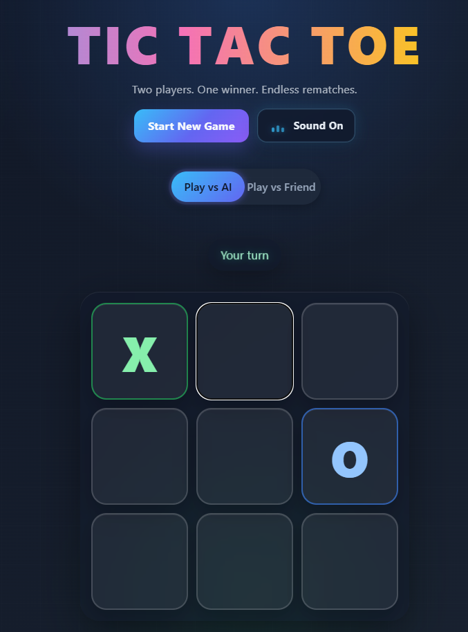
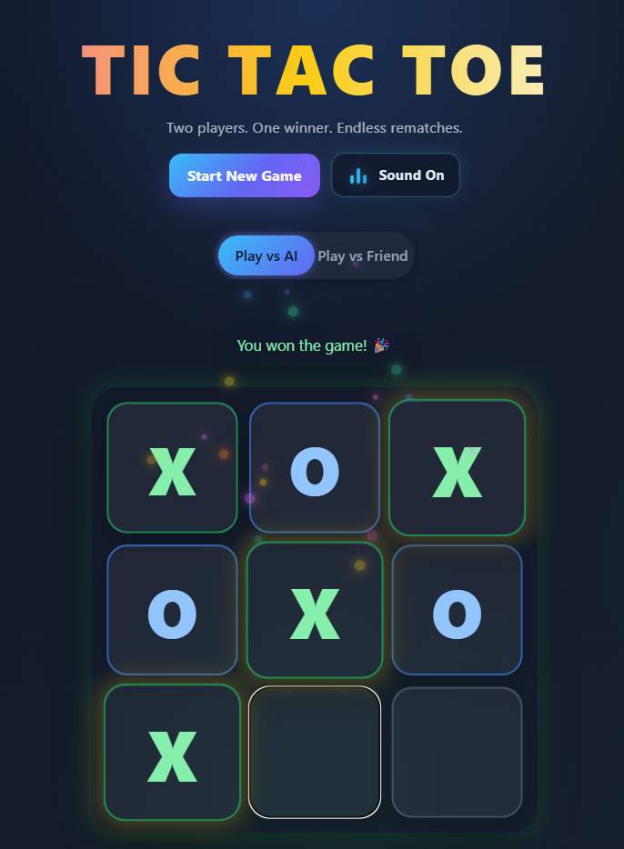
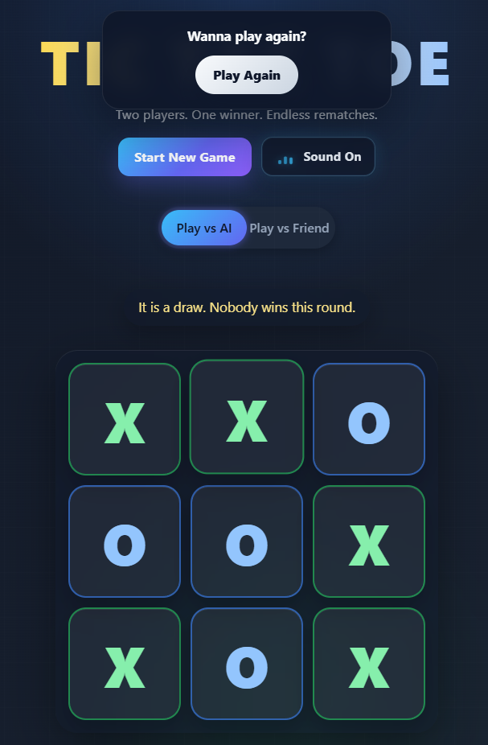

# 🎮 Tic Tac Toe

A modern Tic Tac Toe game built with Angular, featuring AI gameplay, smooth animations, sound effects, and PWA support for an app-like experience.

---

## 🚀 Live Demo

👉 https://tic-tac-toe-tau-nine-32.vercel.app/

---

## 🧩 Features

- 🤖 Play against a smart AI or a friend
- 🔄 Instant switching between game modes
- 🧠 AI can win, block, or make random moves
- 🔊 Sound effects (click, win, draw)
- ✨ Animated UI with glowing effects
- 🌌 Dynamic background visuals
- 🎉 Victory celebration animations
- 📱 Fully responsive (mobile & desktop)
- 📦 Installable PWA (works offline)

---

## 🛠 Tech Stack

- Angular
- TypeScript
- SCSS
- HTML
- Angular PWA
- Vercel

---

## 📦 Installation

```bash
npm install
```

---

## ▶️ Run Locally

```bash
ng serve
```

Open in browser:

```
http://localhost:4200
```

---

## 🏗 Build for Production

```bash
ng build --configuration production
```

---

## 📁 Project Structure

```bash
src/
  app/
    board/        # game board logic & UI
    square/       # individual cell component
    app.component.ts
    app.module.ts
  assets/
    sounds/       # click, win, draw effects
    icons/        # PWA icons
  environments/   # environment configs
  index.html
  main.ts         # app bootstrap
```
---

## 🔊 Sound Files

Located in:

```bash
src/assets/sounds/
```

Required:

- click.mp3
- win.mp3
- draw.mp3

---

## 📸 Screenshots





---

## 📱 PWA Support

- Installable on desktop & mobile
- Runs fullscreen like a native app
- Works offline after first load

---

## 🌍 Deployment

Deployed using Vercel

Build command:

```bash
ng build --configuration production
```

Output directory:

```bash
dist/tic-tac-toe
```

---

## 📝 Notes

- AI mode resets the board when switching modes
- Dynamic player turn indicator
- Includes sound & animation feedback

---

## 📊 Badges


---

## ⭐ Future Improvements

- Difficulty levels for AI
- Online multiplayer
- Score tracking system
- Custom themes

---

## 👨‍💻 Author

Your Name  
GitHub: https://github.com/Faresaymann
